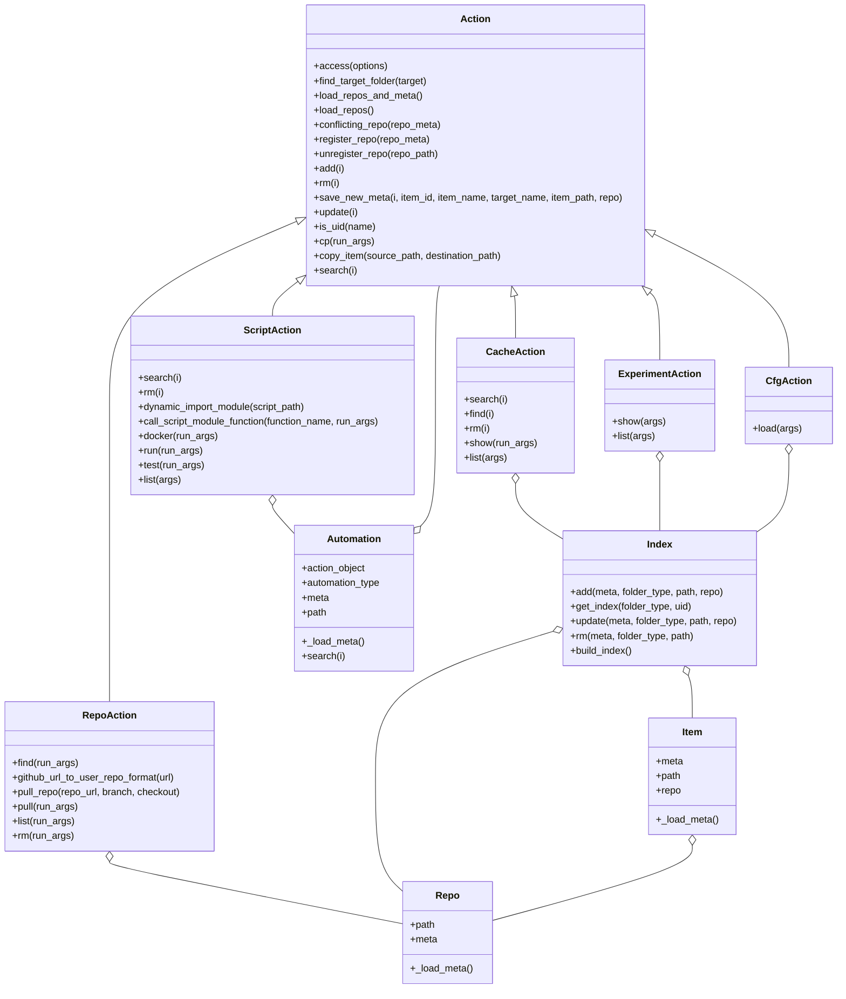

**MLCFlow: Simplifying MLPerf Automations**

[](https://github.com/mlcommons/mlcflow/blob/main/LICENSE.md)
[](https://pepy.tech/project/mlcflow)

[](https://github.com/mlcommons/mlcflow/actions/workflows/test-mlc-core-actions.yaml)
[](https://github.com/mlcommons/mlperf-automations/actions/workflows/test-mlc-script-features.yml)
[](https://github.com/mlcommons/mlcflow/actions/workflows/mlperf-inference-resnet50.yml)
[](https://github.com/mlcommons/mlcflow/actions/workflows/mlperf-inference-bert.yml)


MLCFlow is a versatile CLI and Python interface developed by MLCommons in collaboration with a dedicated team of volunteers (see [Contributors](https://github.com/mlcommons/mlcflow/blob/main/CONTRIBUTORS.md)). It serves as a streamlined replacement for the [CMind](https://github.com/mlcommons/ck/tree/master/cm) tool, designed to drive the automation workflows of MLPerf benchmarks more efficiently. You can use this tool for any of your workflow automation tasks. 

The concept behind CMind originated from **Grigori Fursin**, while the **MLPerf Automations** project was created by **Grigori Fursin** and **Arjun Suresh**, whose collective contributions laid the foundation for modernizing MLPerf benchmarking tools. MLCFlow is a complete replacement for the CMind package with an entirely new implementation led by **Arjun Suresh** and **Anandhu Sooraj**, with support from the [MLCFlow community](https://github.com/mlcommons/mlcflow/blob/main/CONTRIBUTORS.md). The script automation used in MLCFlow is inherited from the CM project but is now modified to support MLC and provides a simpler interface to the devlopers. Please see [the documentation](https://docs.mlcommons.org/mlcflow/) for more details. 

On February 9, 2025, MLCFlow released its first stable version, 1.0.0.

### Key Features
Building upon the core idea of CMind—wrapping native scripts with Python wrappers and YAML metadata—MLCFlow focuses exclusively on key automation components: **Scripts**, along with its complementary modules: **Cache**, **Docker**, and **Experiments**. This targeted design simplifies both implementation and interface, enabling a more user-friendly experience.

---

### Status
MLCFlow is now fully equipped for workflow development, with complete support for all previously used CM scripts in MLPerf inference automation. If you're interested in discussions, join the MLCommons Benchmark Infra [Discord channel](https://discord.gg/T9rHVwQFNX), and check out the latest progress in [Issues](https://github.com/mlcommons/mlcflow/issues).

---

## MLC CLI Overview

The **MLC Command-Line Interface (CLI)** enables users to perform actions on specified targets using a simple syntax:

```bash
mlc <action> <target> [options]
```

### Key Components:
- **`<action>`**: The operation to be performed.
- **`<target>`**: The object on which the action is executed.
- **`[options]`**: Additional parameters passed to the action.

---

### Supported Targets and Actions

#### 1. **Repo**
- Actions related to repositories, such as cloning or updating.

#### 2. **Script**
- Manage or execute automation scripts.

#### 3. **Cache**
- Handle cached data, including cleanup or inspection.

Each target has its own set of specific actions to tailor automation workflows as specified below.


| Target | Action          |
|--------|-----------------|
| script    | run, find/search, rm, mv, cp, add, test, docker, show       |
| cache    | find/search, rm, show  |
| repo    | pull, search, rm, list, find/search , add        |


MLC started with a compatibility layer where by it supported MLCommons CM automations - Script, Cache and Experiment. Now, MLCFLow has just the Script Automation which is an extension of the Script Automation from CM but with a cleaner integration of Cache Automation and Docker and Test extensions. The old CM scripts are now updated with the latest MLCFlow scripts in the [MLPerf Automations](https://github.com/mlcommons/mlperf-automations/tree/main/script) repository. 


## Architectural Diagram



