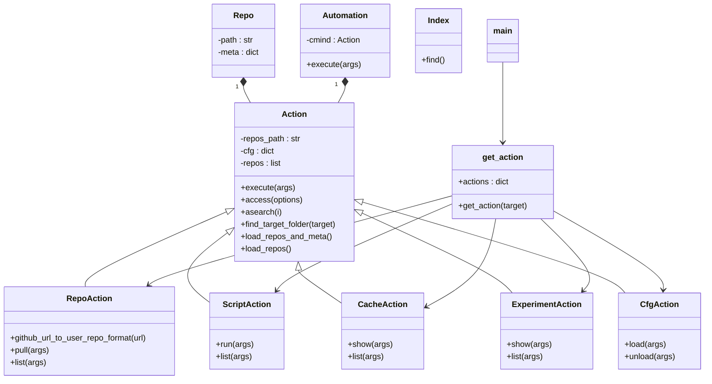

# MLC Automation

This repository provides the codebase for **MLC Automation**, a streamlined interface for creating workflow automations. It is created as a simplified version of [Collective Mind](https://github.com/mlcommons/ck/tree/master/cm) package to be used in MLPerf Automations.

---

## MLC CLI Overview

The **MLC Command-Line Interface (CLI)** enables users to perform actions on specified targets using a simple syntax:

```bash
mlc <action> <target> [options]
```

### Key Components:
- **`<action>`**: The operation to be performed.
- **`<target>`**: The object on which the action is executed.
- **`[options]`**: Additional parameters passed to the action.

---

### Supported Targets and Actions

#### 1. **Repo**
- Actions related to repositories, such as cloning or updating.

#### 2. **Script**
- Manage or execute automation scripts.

#### 3. **Cache**
- Handle cached data, including cleanup or inspection.

Each target has its own set of specific actions to tailor automation workflows.

## CM compatibility layer

MLC has a compatibility layer where by it supports MLCommons CM automations.

## Architectural Diagram

This project is a work in progress and the below diagram is expected to change.



