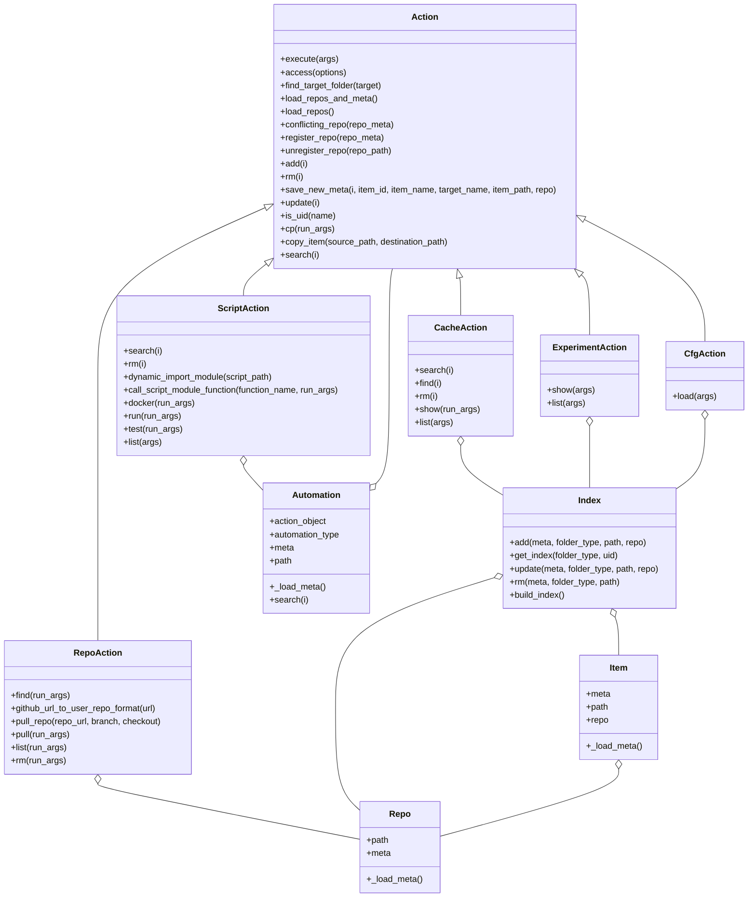

**MLCFlow: Simplifying MLPerf Automations**

[](LICENSE.md)
[](https://pepy.tech/project/mlcflow)
[](https://github.com/mlcommons/mlperf-automations/actions/workflows/test-mlc-script-features.yml)


MLCFlow is a versatile CLI and Python interface developed by MLCommons in collaboration with a dedicated team of volunteers (see [Contributors](CONTRIBUTORS.md)). It serves as a streamlined replacement for the [CMind](https://github.com/mlcommons/ck/tree/master/cm) tool, designed to drive the automation workflows of MLPerf benchmarks more efficiently. 

The concept behind CMind originated from **Grigori Fursin**, while the **MLPerf Automations** project was created by **Grigori Fursin** and **Arjun Suresh**, whose collective contributions laid the foundation for modernizing MLPerf benchmarking tools.

### Key Features
Building upon the core idea of CMind—wrapping native scripts with Python wrappers and YAML metadata—MLCFlow focuses exclusively on key automation components: **Scripts**, along with its complementary modules: **Cache**, **Docker**, and **Experiments**. This targeted design simplifies both implementation and interface, enabling a more user-friendly experience.

### Status
MLCFlow is currently a **work in progress** and not yet ready for production use. If you are interested in contributing to its initial development, please email [arjun@mlcommons.org](mailto:arjun@mlcommons.org) to join the daily development meetings and see [Issues](https://github.com/mlcommons/mlcflow/issues) for seeing the development progress.

### Getting Started
For early contributors, please use the `mlc` branch of the [MLPerf Automations](https://github.com/mlcommons/mlperf-automations) repository while working with MLCFlow.


---

## MLC CLI Overview

The **MLC Command-Line Interface (CLI)** enables users to perform actions on specified targets using a simple syntax:

```bash
mlc <action> <target> [options]
```

### Key Components:
- **`<action>`**: The operation to be performed.
- **`<target>`**: The object on which the action is executed.
- **`[options]`**: Additional parameters passed to the action.

---

### Supported Targets and Actions

#### 1. **Repo**
- Actions related to repositories, such as cloning or updating.

#### 2. **Script**
- Manage or execute automation scripts.

#### 3. **Cache**
- Handle cached data, including cleanup or inspection.

Each target has its own set of specific actions to tailor automation workflows as specified below.


| Target | Action          |
|--------|-----------------|
| script    | run, search, rm, mv, cp, add, list, test, docker, show          |
| cache    | search, rm, list, show, find          |
| repo    | pull, search, rm, list, find          |


## CM compatibility layer

MLC has a compatibility layer where by it supports MLCommons CM automations - Script, Cache and Experiment. 

## Architectural Diagram



